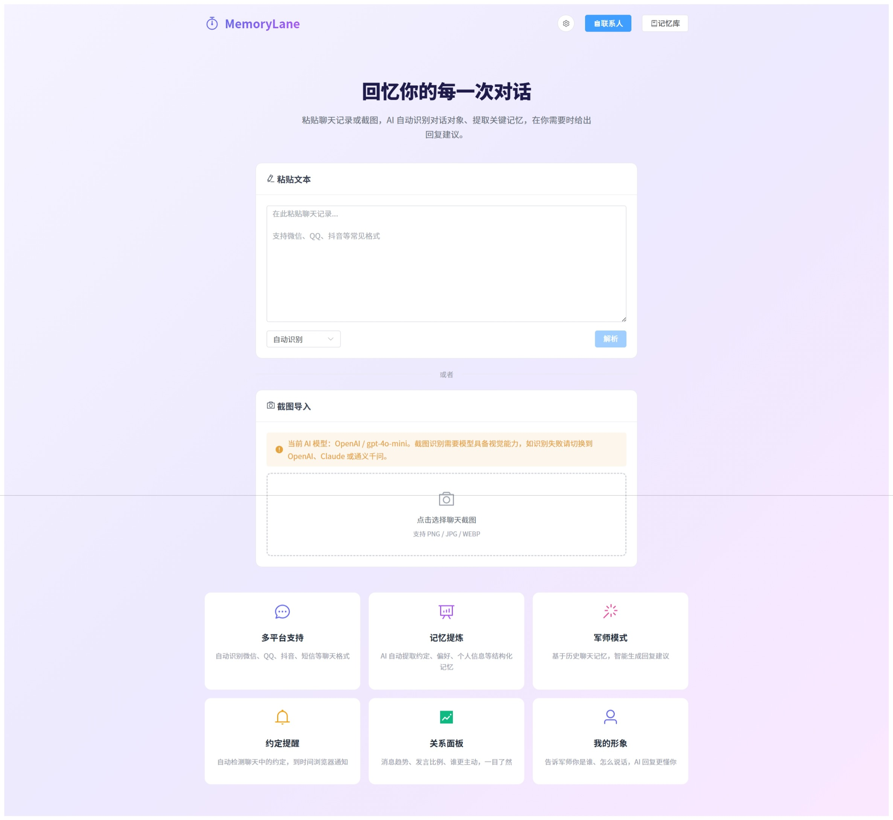

# MemoryLane · 忆路

> 跨平台聊天记录 AI 记忆分析工具 —— 粘贴聊天文本，AI 自动识人、归档、记忆，帮你记住每段关系里的一切。

[](LICENSE)
[]()

---

## ✨ 做什么的

从微信、QQ、抖音、短信等任何平台复制聊天记录，粘贴进来——AI 自动：

- 🧑‍🤝‍🧑 **区分说话人**，自动识别微信/QQ/QQ PC/抖音/短信 5 种格式
- 🗂️ **结构化存储**到 Postgres，按联系人/会话归类，SHA-256 去重
- 🧠 **提炼长期记忆**：约定、偏好、个人信息、事件、人设、关系动态（6 类）
- 🔍 **全文搜索**：CJK 字级分词 + tsvector 检索，搜「发烧」能命中「lim 发烧刚好」
- 📇 **联系人管理**：多选合并、自动去重检测、profile 深合并、级联删除
- 🖼️ **截图导入**：上传聊天截图 → AI OCR 识别 → 自动填入文本解析管线
- 💬 **军师模式 2.0**：微信风聊天模拟器，逐句 AI 建议 → 点选回复 → 全程保存。支持 6 种回复风格切换（默认/幽默/可爱/温柔/高冷/傲娇）
- 👤 **用户人设**：手动编辑 + LLM 自动分析（读取 self 消息推断性格/说话风格）
- 📊 **关系动态**：Chart.js 三线图 + 统计卡片，量化每段关系
- ⏰ **约定提醒**：自然语言时间解析（「明天下午三点」），定时推送
- ⚙️ **Prompt 模板**：10 个种子模板 + 自定义编辑，运行时生效
- 🔄 **OCR 容错**：LLM 识别失败自动降级 Tesseract（chi_sim + eng）

> ⚠️ 本项目不需要破解任何 app 的加密数据库。所有数据由用户主动粘贴，隐私可控。



---

## 🏗️ 技术栈

| 层 | 技术 |
|---|---|
| 后端 | Java 17 + Spring Boot 3.4 + Spring AI 1.0.0-M6 |
| 数据库 | PostgreSQL 16 + pgvector + tsvector（全功能单库） |
| 前端 | Vue 3 + Element Plus + Vite |
| AI | OpenAI / DeepSeek / Ollama / Anthropic / DashScope / ZhiPu / Moonshot（DB 热切换） |
| 部署 | Docker Compose |

---

## 🚀 快速开始（Docker，推荐）

> 📖 **从零开始？** 看这篇：[完整安装指南 →](docs/SETUP.md)
>
> 包含：Docker 安装教程 + 国内镜像加速 + DeepSeek/通义 API Key 申请 + 图文全流程。

不用装 JDK、不用装 Maven、不用装 Postgres。只要装个 Docker Desktop。

```bash
# 1. 下载项目
git clone https://github.com/denglizibinghua/MemoryLane.git
cd MemoryLane

# 2. 配置 AI API Key（支持 OpenAI / DeepSeek / 通义 / Ollama / 智谱 / Moonshot）
cp .env.example .env
# 编辑 .env → 填入你的 API Key，选填模型名

# 3. 一键启动（首次构建大约 3-5 分钟，之后秒起）
docker-compose up -d

# 4. 打开浏览器
# http://localhost:3000  ← 前端
# http://localhost:8080  ← 后端 API（如需直连）
```

> 💡 启动后在「设置」页面可以随时切换 AI provider，API Key 热更新，不用重启。
>
> 💡 截图 OCR 降级（Tesseract）的语言包已在构建时自动下载，开箱即用。

---

### 🛠️ 手动开发（需要本地 Java + Node 环境）

```bash
# 数据库
docker run -d --name memorylane-db -p 5432:5432 \
  -e POSTGRES_DB=memorylane -e POSTGRES_USER=memorylane -e POSTGRES_PASSWORD=memorylane123 \
  pgvector/pgvector:pg16

# 后端（JDK 17 + IDEA → Open server/pom.xml → Run MemoryLaneApplication）
# 端口：8080

# 前端
cd web
npm install --legacy-peer-deps
npm run dev
# 端口：3000，代理 /api → localhost:8080
```

---

## 📋 当前进度（v0.8.0）

- [x] 竞品调研（WeLink、ChatLab、Graphiti、Mem0）
- [x] 架构设计文档（724 行，覆盖 DDL/API/产品决策）
- [x] 项目脚手架：Spring Boot 3.4 + Vue 3
- [x] 7 种 AI provider：DB 配置热切换，无需重启
- [x] 文本导入管线：5 种格式识别（微信/QQ/QQ PC/抖音/短信）→ 多联系人分发 → 去重入库
- [x] 记忆提取：@Async 异步 → LLM 重要性分类 → 6 类结构化记忆 → 3 层合并
- [x] 全文搜索：CJK 字级分词 + tsvector，支持按联系人过滤
- [x] 联系人管理：多选合并、自动去重检测、profile 深合并、级联删除
- [x] 记忆详情：点击展开源消息气泡
- [x] 截图 OCR 导入：LLM 识别 → Tesseract 自动降级 → 统一文本解析管线
- [x] 军师模式 2.0：微信风聊天模拟器 + 6 种 AI 回复风格
- [x] Prompt 模板系统：10 个种子模板 + 自定义编辑 + 运行时生效
- [x] 关系动态面板：Chart.js 趋势图 + 统计卡片
- [x] 用户人设系统：手动编辑 + LLM 分析推断（self 消息 → 性格/风格/关系）
- [x] 约定提醒：自然语言时间解析 + 定时通知
- [x] pgvector 扩展已安装，语义搜索代码就绪
- [x] 稳定性修复：platform 真实检测、self 防误入联系人、按会话去重、截图导入统一流
- [x] Docker 一键部署：docker-compose up -d，零环境依赖，含 Tesseract OCR

---

## 📂 项目结构

```
MemoryLane/
├── server/                          # Spring Boot 后端
│   └── src/main/java/com/memorylane/
│       ├── adapter/                 # 输入适配器（文本粘贴）
│       ├── parser/                  # 平台格式识别 + 说话人提取
│       ├── memory/                  # 记忆引擎（重要性分类 + 事实提取 + 合并）
│       ├── retrieval/               # 检索层（全文 + 语义 + 混合排序）
│       ├── service/                 # 业务服务（联系人合并、AI 设置、军师）
│       ├── controller/              # REST API
│       ├── config/                  # Spring AI 配置 + 动态模型工厂
│       ├── entity/                  # JPA 实体
│       ├── repository/              # Spring Data Repositories
│       └── dto/                     # 请求/响应 DTO
├── web/                             # Vue 3 前端
│   └── src/
│       ├── views/                   # 页面（首页、联系人、记忆库、军师、动态、提醒、人设、设置）
│       ├── stores/                  # Pinia 状态管理
│       ├── api/                     # axios API 封装
│       └── router/                  # 路由配置
├── docs/ARCHITECTURE.md             # 架构设计文档
└── docker-compose.yml               # Docker 部署
```

---

## 📄 License

AGPL-3.0 — 使用本代码的项目必须同样以 AGPL-3.0 开源。
